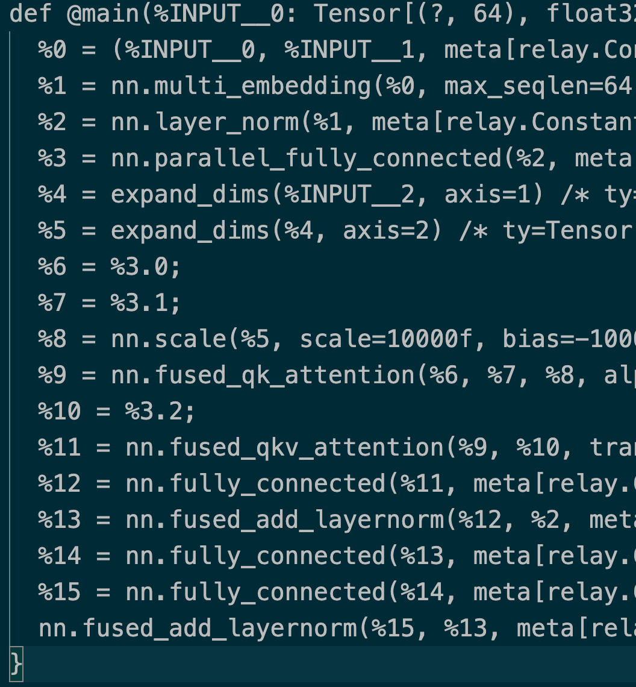
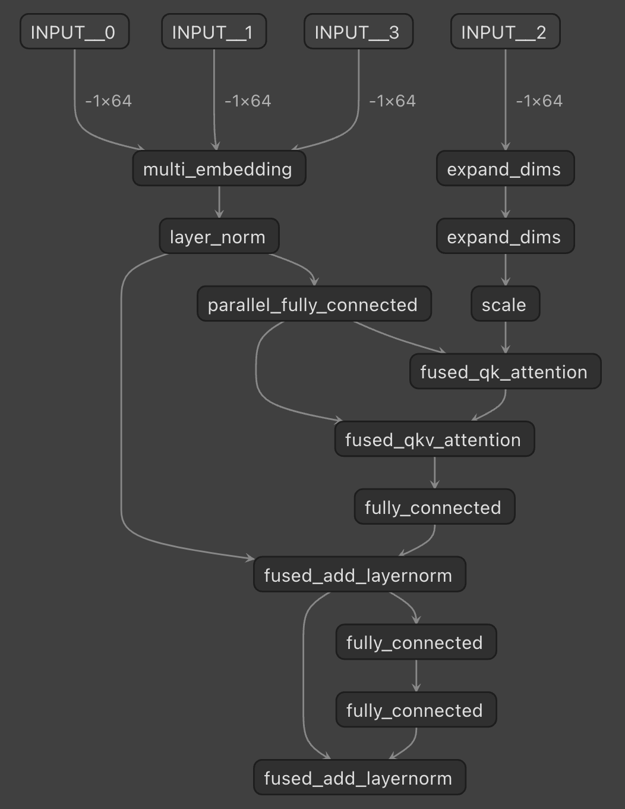
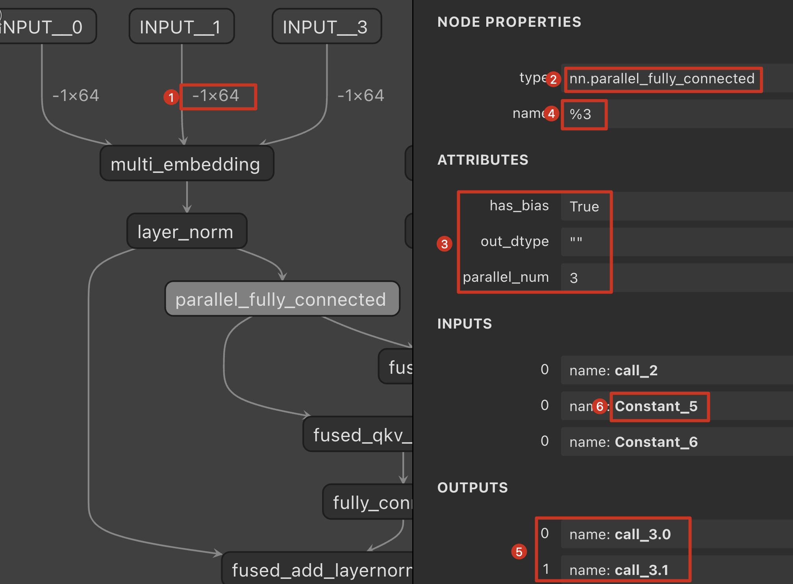
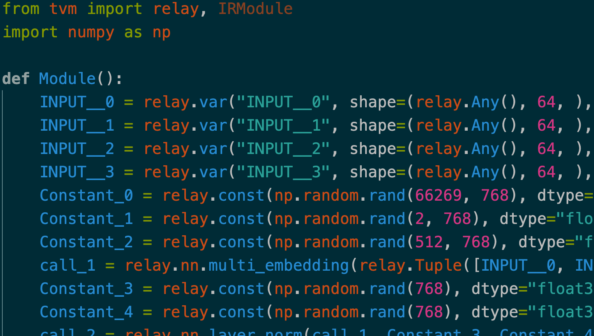

## 一. 前言

推理框架开发过程中, netron是最佳的模型可视化工具, 支持各类推理框架, 但是不支持tvm. 这里有一个相关[issue](https://github.com/lutzroeder/netron/issues/199)的讨论. 但是作为开发者或者使用者, relay的可视化是必不可少的, 尤其是涉及图优化等调试时. 因此就有了本工具, 可以将tvm的relay text文本转换成netron能够可视化的caffe prototxt形式. 能够呈现各个Op的连接关系, 以及Op的参数信息. 顺带, 还能够逆向出Python的构建代码, 方便我们因为一些原因在无法获得原始模型的情况下自己构建模型进行调试. 那么我们就叫这个工具为relay_reverse

## 二. 效果展示

可视化前和可视化后



## 三. 快速使用

```bash
git clone https://github.com/HuangShiqing/MyNet
cd MyNet/tool/tvm
python relay_reverse.py -i ./a.txt
```

## 四. relay text格式简介

```c++
def @main(%INPUT__0: Tensor[(1, 64), int64], %INPUT__1: Tensor[(1, 64), int64], %INPUT__2: Tensor[(1, 64), int64], %INPUT__3: Tensor[(1, 64), int64]) -> Tensor[(1, 1), float32] {
  %0 = (%INPUT__0, %INPUT__1, meta[relay.Constant][0] /* ty=Tensor[(66269, 768), float32] */, meta[relay.Constant][1] /* ty=Tensor[(2, 768), float32] */, meta[relay.Constant][2] /* ty=Tensor[(512, 768), float32] */, %INPUT__3);
  %1 = nn.multi_embedding(%0, max_seqlen=64, table_num=3, out_dtype="float16") /* ty=Tensor[(1, 64, 768), float16] */;
  %7 = dyn.reshape(%2, %6, newshape=[]) /* ty=Tensor[(?, ?, ?), float32] */;
  %85 = take(%84, 0 /* ty=int64 */, axis=0) /* ty=int64 */;
  %114 = subtract(1f /* ty=float32 */, %90);
  %186 = (meta[relay.Constant][51] /* ty=Tensor[(1), int64] */, %162);
  %595 = add(%594, meta[relay.Constant][148] /* ty=Tensor[(768), float32] */, meta[relay.attrs.BinaryAttrs][25]) /* ty=Tensor[(?, ?, 768), float32] */;
  %985 = (%984,);
```

+ 在文本格式中, 全局变量以@为前缀，局部变量以%为前缀. 不过一般一个网络就由若干个局部变量组成一个全局main

+ def @main(%input0: shape info, %input1: shape info...)->output shape info {

  第一行给出了模型输入和输出的数量及shape信息

+ 其后的每一行都是一个局部变量Var的计算过程, 一般是两种形式, 一种是以Op操作计算Var, 如%1 = nn.multi_embedding(...), 另外一种是组合多个Var产生新的Var, 如%0 = (%INPUT__0, %INPUT__1...)

+ 对于Op操作, 部分默认参数可能不会显示出来

+ Op可能是多输出, 但是在计算过程看不出来, 作为输入时会以xx.1, xx.2的形式展现. 如xx

+ relay.Constant和relay.attrs.BinaryAttrs都是一种特殊的Var, 不需要产生它的计算过程, 可以直接使用的. meta\[relay.Constant\][xx]里的xx代表该Constant的id号. relay text不会给出Constant具体的数值

+ 标量也是一种特殊的Var, 如 %85 = take(%84, 0)

+ Var的组合可能只组合了一个Var, 如%985 = (%984,);

+ 每行计算过程都会有若干个/\*...\*/包含在内的Tensor信息, 这个是由某个图优化pass推出来的

## 五. 可视化



有一些特性需要做出说明:

1. 对于动态维度any, 不会以问号显示, 而是以-1显示, 因为prototxt不支持问号
2. 能显示Op的type, 且支持自定义的type. 如果type名包含点, 不会显示点前面内容
3. 能显示relay text里Op的参数.
4. 以Var的名字%xx为Call的name, 并且保留了名字里的百分号%
5. 输出Var的名字为call_xx, 如果是多输出, 则分别为call_xx.0, call_xx.1, call_xx.2等
6. 不会以节点的形式显示Constant, 而且Constant具体的数值不能显示, 这是由于prototxt造成的
7. 暂时未支持显示输出Var的shape, 貌似caffe的prototxt在netron里就不能显示shape, 怕是不能用prototxt, 所以敬请期待

有时对于一个复杂庞大的网络模型, netron显示整张图会非常凌乱, 建议采用分块的方法. 

## 六. 逆向为Python构建代码



生成一个relay_python.py的文件, 包含一个函数Module, 直接import使用即可

```python
import tvm
from tvm import relay, IRModule
from relay_python import Module

mod = Module()
print(mod)

with relay.build_config(opt_level=3):
		lib= relay.build(mod, target=None, params=None)
```
